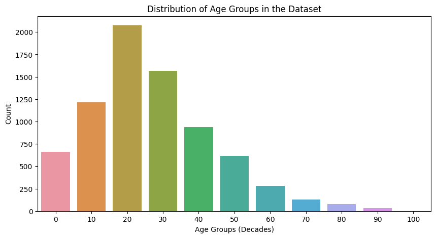
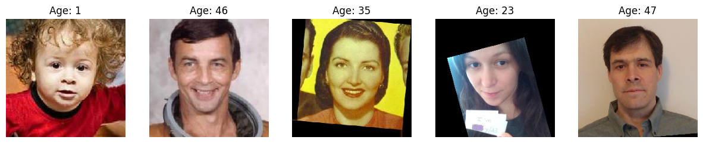

# Human Age Prediction (Computer Vision)

## Table of Contents
- [Overview](#overview)
- [Business Problem](#business-problem)
- [Dataset](#dataset)
- [Exploratory Data Analysis (EDA)](#exploratory-data-analysis-eda)
- [Modeling Approach](#modeling-approach)
- [Results & Model Performance](#results--model-performance)
- [Key Insights & Business Impact](#key-insights--business-impact)
- [Next Steps & Potential Improvements](#next-steps--potential-improvements)
- [How to Use](#how-to-use)
- [Connect With Me](#connect-with-me)

---

## Overview
This project explores **computer vision techniques** to predict a person’s age from images. The goal is to determine whether machine learning can help a **supermarket chain** ensure compliance with **alcohol sales laws** by verifying a customer's age at checkout.

## Business Problem
**Good Seed**, a supermarket chain, wants to implement an automated system to prevent underage alcohol sales. They aim to:
- Use **computer vision** to estimate a customer’s age from a photo.
- Train a **convolutional neural network (CNN)** to make accurate predictions.
- Evaluate the feasibility of AI-powered age verification.

## Dataset
The dataset is sourced from **ChaLearn Looking at People** and contains:
- **Images**: Stored in the `final_files/` folder.
- **Labels**: A CSV file (`labels.csv`) with:
  - `file_name` → Image filename.
  - `real_age` → True age of the individual.

Given the large dataset size (~7,600 images), **data generators** were used for efficient loading.

---

## Exploratory Data Analysis (EDA)
### **Key Findings**
- **Age distribution**: The dataset covers a broad age range but has more images of younger individuals.
- **Visual inspection**: Sample images confirmed variability in lighting, angles, and expressions, impacting model accuracy.

#### **Age Distribution**

#### **Sample Images Across Ages**

---

## Modeling Approach
The model uses a **pretrained ResNet50 architecture** with fine-tuning:
- **Base Model**: ResNet50 (pretrained on ImageNet).
- **Additional Layers**:
  - GlobalAveragePooling2D for feature extraction.
  - Dense layer with ReLU activation.
  - Output layer predicting a **single continuous value** (age).
- **Loss Function**: Mean Squared Error (MSE).
- **Optimizer**: Adam (learning rate: 0.0005).

### **Model Training**
The model was trained on **GPU** using **data augmentation**:
- Horizontal flips and rotations to improve generalization.
- Mini-batches for memory efficiency.
- Early stopping to prevent overfitting.

---

## Results & Model Performance
| Epoch | Train MAE | Validation MAE |
|-------|-----------|---------------|
| 1     | 7.43      | 8.49          |
| 5     | 5.59      | 8.21          |
| 10    | 4.14      | 6.96          |
| 15    | 3.67      | 6.78          |
| **20** | **3.17**  | **7.65**      |

- The final **MAE (Mean Absolute Error) = 7.1 years**.
- The model performs **well for middle-aged individuals** but struggles with extreme age groups.
- Validation loss fluctuated, suggesting further tuning is needed.

---

## Key Insights & Business Impact
- **Moderate accuracy**: The model can estimate age within ~7 years, making it unreliable for strict legal compliance.
- **Practical applications**: Useful for **pre-screening** but requires human verification for final decisions.
- **Challenges**:
  - Poor performance on very young & elderly individuals.
  - External factors (lighting, facial expressions) impact predictions.

### **Business Recommendations**
- **Use AI as an assistive tool**, not a standalone verification system.
- **Combine with ID scanning** for more reliable validation.
- **Train on a more balanced dataset** with improved age representation.

---

## Next Steps & Potential Improvements
- **Fine-tune model hyperparameters** to reduce MAE.
- **Experiment with deeper architectures** (EfficientNet, Vision Transformers).
- **Incorporate additional facial features** for better predictions.
- **Train on a larger, more diverse dataset** to improve generalization.

---

## How to Use
### Clone the repository:
      
      git clone https://github.com/rhi-222/human-age-prediction.git

### Install dependencies:
     
      pip install tensorflow keras matplotlib numpy pandas seaborn

### Run the Jupyter Notebook:
- Open `[updated]HumanAge(ComputerVision).ipynb` in Jupyter Notebook or Google Colab.
- Execute the notebook to preprocess images, train the model, and evaluate predictions.

## Connect With Me
- Email: rhiannon.filli@gmail.com
- LinkedIn: linkedin.com/in/rhiannonfilli
